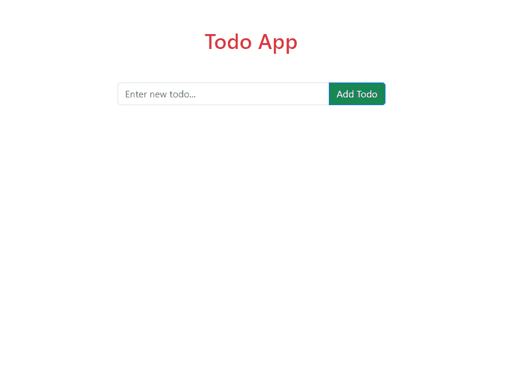

# React Todo App
<h3>visit: https://react-todo-list-apps.netlify.app/</h3>

## Description:
In this project, a simple React Todo App is developed, allowing users to add and manage their todo items. The application comprises two main components: Header and TodoList. Additionally, the Bootstrap CSS library is used for styling.

## Components:

### Header
- The Header component serves as the main entry point of the Todo App.
- It contains the state hooks 'input' and 'list'. 
- The 'list' state is initialized using the useState hook and retrieves previous data from localStorage, if available.
- The component includes functionality to add, delete, and mark todo items as completed.
- Users can input new todo items in the text input, and pressing 'Enter' or clicking the 'Add Todo' button will add the item to the list.
- If the input is empty and the 'Add Todo' button is clicked, an alert is shown to prompt the user to add a todo list.
- The list of todo items is rendered as an unordered list (<ul>) using the map function to display the items and their corresponding status (completed or not).
- Todo items can be marked as completed or not completed by double-clicking on them.
- A 'Delete' button for each todo item allows users to remove items from the list.
- The component uses localStorage to store the todo list, ensuring that the data persists when the user reloads the page or revisits the app.

### TodoList
- The TodoList component is a placeholder component, currently empty and not used in the application.

## Styling
- The application utilizes Bootstrap CSS to style the elements. 
- The Header component contains a heading displaying "Todo App" in red and centered at the top.
- An input field with a 'Add Todo' button allows users to input new todo items.
- Todo items are displayed as a list with a checkbox for completed items.
- Completed items have a strikethrough effect, while non-completed items are displayed normally. 

## Summary
The React Todo App is a straightforward yet functional application that allows users to manage their todo items. It demonstrates the use of React's state management with the useState hook, handling user interactions, and basic styling with the Bootstrap CSS library. The app provides an easy-to-use interface for adding, deleting, and marking todo items as completed, with the ability to persist data using localStorage. This project serves as a foundation for more advanced todo applications or can be further enhanced with additional features and styling.
